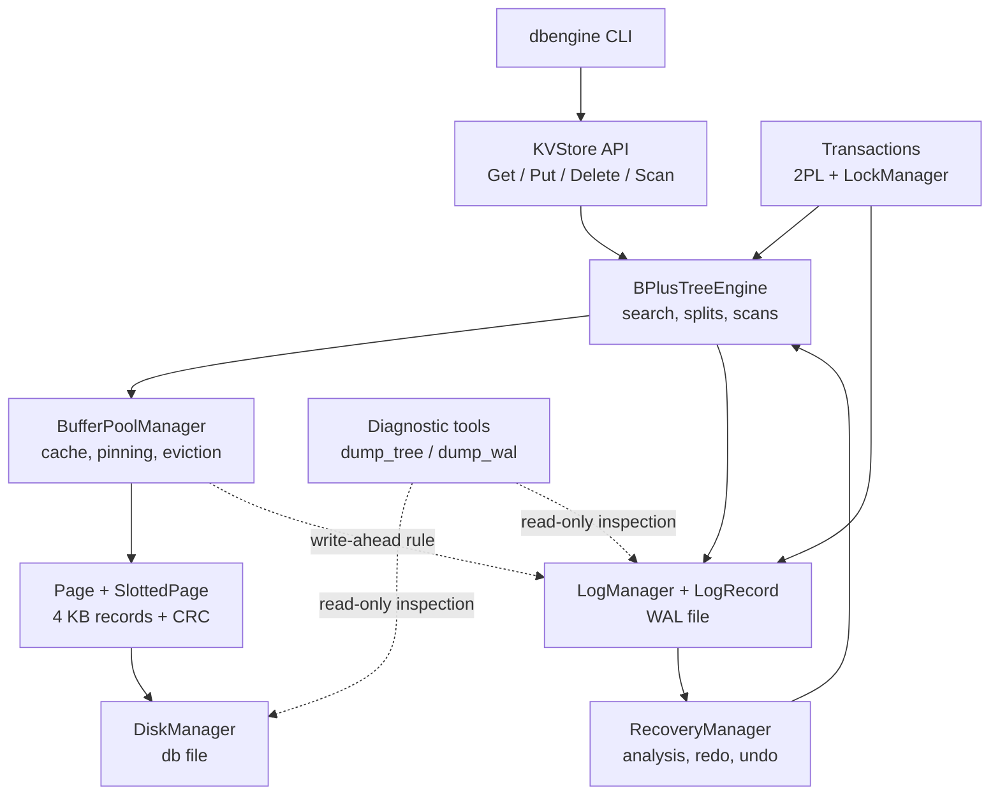

# Slit -- KV Storage Engine

A disk-backed key-value database. It stores ordered keys in a
B+ tree and includes slotted pages, a buffer pool, CRC checksums, a write-ahead
log (WAL), crash recovery, and transaction locking.


## Current component graph



`Slit` is a single-node engine: operations enter through the key-value
API, the B+ tree finds or changes records, the buffer pool manages pages, and
the disk manager persists them. Transactions add locking and WAL records;
recovery replays or rolls back WAL data after an unclean shutdown.

## Features

- `Get`, `Put` (insert or update), `Delete`, and ordered `Scan` operations.
- 4 KB page storage with variable-length keys and values.
- B+ tree node splitting, leaf links, free-page reuse, and invariant checks.
- Buffer-pool caching with clock replacement and page latches.
- WAL records with LSNs, before/after images, framing, and CRC validation.
- ARIES-lite analysis, redo, and undo recovery after an unclean shutdown.
- Shared/exclusive key locks, 2PL two-phase locking, commit, and abort.
- Read-only tools for viewing the database tree and WAL contents.

## Requirements

- C++20 compiler: GCC 12+, Clang 15+, or MSVC 2022
- CMake 3.16+
- Ninja (recommended)

## Build

```bash
git clone https://github.com/Aayushgoyal00/dbengine.git
cd dbengine
cmake -S . -B build -G Ninja -DCMAKE_BUILD_TYPE=Release
cmake --build build
```

On Windows PowerShell, run the executables as `.\build\dbengine.exe` and
`.\build\dump_tree.exe` (or use the equivalent paths for your generator).

## Basic CLI operations

Start the CLI with `build/dbengine` (`build\dbengine.exe` on Windows). It uses
`dbengine.db` for pages and `dbengine.wal` for the WAL.

```text
help
put user:1 Alice
get user:1
scan user:1 10
delete user:1
bulk_put 2000
pages
exit
```

`scan <start_key> [limit]` returns sorted records beginning at the supplied
key; the default limit is 20. `bulk_put` defaults to 2,000 records. Values may
contain spaces, but keys are single tokens.

## Inspect the database and WAL

Run these after creating data. The database file is binary, so do not edit it
as text.

```bash
# B+ tree as readable pages, keys, values, children, and leaf links
build/dump_tree dbengine.db --pretty

# Same tree as JSON, useful for scripts and structural checks
build/dump_tree dbengine.db

# WAL counts and CRC/frame validation
build/dump_wal dbengine.wal

# Every WAL record, including LSN, transaction, page, and images
build/dump_wal dbengine.wal --full

# File size, first bytes, and decoded WAL frames
build/inspect_demo_files dbengine.db dbengine.wal
```

To evaluate the tree, note the `root_page`, internal-page `children`, leaf
`keys`, and `next_leaf` links in `dump_tree`. A healthy tree has valid checksums,
reachable child pages, sorted keys, and a complete left-to-right leaf chain.
To evaluate the WAL, use its total record counts and `--full` output; a failed
validation reports a corrupt or incomplete frame.

## Tests

```bash
ctest --test-dir build --output-on-failure
```

This runs disk/page allocation, slotted-page serialization and CRC checks,
B+ tree splits and scans, buffer-pool eviction and write-ahead ordering,
WAL recovery, buffer-pool B+ tree behavior, transaction concurrency, and
crash recovery. Run one test directly when debugging, for example:

```bash
build/tests/test_crash_recovery
build/tests/test_transaction_concurrency
```

## Workload and concurrency checks

```bash
# Deterministic random workload: [db] [wal] [count]
build/random_kv_benchmark demo.db demo.wal 200

# Concurrent transactions: [db] [wal] [threads] [ops/thread] [key_count]
build/transaction_concurrency_benchmark demo.db demo.wal 8 100 450
```

The concurrency benchmark reports committed/failed operations, throughput,
final key verification, and B+ tree invariant status. A successful run should
show `Failed: 0` and `Tree invariants: PASS`.

### Benchmarks

Concurrent transaction benchmarks were recorded on a Windows/Git Bash
development machine. Results are reference measurements and will vary with
hardware, compiler, build configuration, storage, and system load.

**Headline:** approximately **261 TPS peak** on a 16,000-operation
transactional UPDATE workload, scaling from 1 to 16 threads before contention
causes throughput to plateau.

#### Concurrent UPDATE: 16,000 operations, 500 keys

```bash
build/transaction_update_benchmark.exe benchmark_update.db benchmark_update.wal 16000 500
```

| Threads | TPS | p50 | p95 | p99 |
|---:|---:|---:|---:|---:|
| 1 | 113.76 | 8.44 ms | 12.38 ms | 14.25 ms |
| 2 | 147.86 | 13.80 ms | 21.57 ms | 25.65 ms |
| 4 | 228.75 | 13.30 ms | 37.70 ms | 49.22 ms |
| 8 | 251.37 | 17.41 ms | 83.84 ms | 107.60 ms |
| 16 | **261.45** | 25.36 ms | 186.46 ms | 247.34 ms |
| 32 | 220.00 | 51.97 ms | 309.93 ms | 509.81 ms |

Throughput improves through 16 threads, then declines at 32 threads while tail
latency increases substantially. A shorter 1,000-operation run reached **325.84
TPS at 32 threads**, illustrating the effect of workload size and run
conditions on measured throughput.

#### Transaction correctness

```bash
build/tests/test_transaction_lost_update.exe
```

Concurrent read-modify-write tests across 1, 2, 4, 8, 16, and 32 threads
passed both the lost-update and B+ tree invariant checks.


## Scope

This is a single-node storage engine, not a SQL server or network service.
Copy-on-write and LSM-tree backends are future work.
